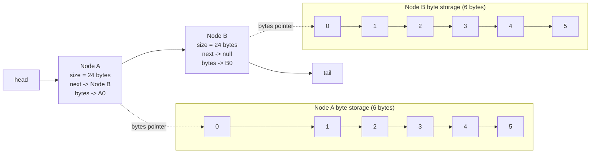

# Project 1 Analysis Report

## Experiment Setup

- Shell: bash (`ulimit -s unlimited` used for all `alloca.out` trials)
- Compiler settings compared: `-g` and `-O2 -g2`
- Main timing tool: `make trials`
- Heap break tool: `make breaks`
- Correctness validation: `make test`

## Correctness Check

Both debug and optimized builds produced identical hashes for all four programs in the same configuration (`NUM_BLOCKS=10000`), so performance comparisons are between functionally equivalent outputs.

## Q1: Which program is fastest? Is it always the fastest?

Across most measured cases, **`malloc.out`** was fastest or tied for fastest.

- Optimized (`-O2 -g2`, `NUM_BLOCKS=200000`, default bytes):
  - `alloca`: avg 0.026s
  - `list`: avg 0.050s
  - `malloc`: avg 0.040s
  - `new`: avg 0.050s
- With realistic block data (`MIN_BYTES=100`, `MAX_BYTES=1000`):
  - `NUM_BLOCKS=200000`: `malloc` avg 0.232s (fastest), `alloca` avg 0.236s (very close)
  - `NUM_BLOCKS=1000000`: `malloc` avg 1.140s (fastest)

So it is **not always uniquely fastest** (some configurations are effectively ties), but it is the most consistently top performer in these trials.

## Q2: Which program is slowest? Is it always the slowest?

In these runs, **`list.out` and `new.out`** were typically the slowest pair, often tied.

- Optimized, default bytes, `NUM_BLOCKS=200000`: both at avg 0.050s.
- Debug (`-g`) amplified this: `list` avg 0.272s and `new` avg 0.250s, clearly slower than `alloca` and `malloc`.

It is **not always exactly one slowest program**, but `list`/`new` generally occupy the slow end.

## Q3: Trend based on data size in each Node

Yes. Runtime increased dramatically as node payload size increased.

At `NUM_BLOCKS=200000`, optimized build:

| Configuration | alloca avg | list avg | malloc avg | new avg |
|---|---:|---:|---:|---:|
| `MIN=10, MAX=10` | 0.018s | 0.034s | 0.022s | 0.028s |
| `MIN=4096, MAX=4096` | 2.174s | 2.132s | 2.082s | 2.102s |

Reason: with larger payloads, byte initialization and hashing dominate total work. The relative cost differences between list/node allocation strategies become smaller compared to the cost of processing much larger byte arrays.

## Q4: Trend based on block chain length

Yes. Runtime increases roughly linearly with `NUM_BLOCKS`.

For `MIN_BYTES=100`, `MAX_BYTES=1000`, optimized build:

| NUM_BLOCKS | alloca avg | list avg | malloc avg | new avg |
|---:|---:|---:|---:|---:|
| 10,000 | 0.018s | 0.018s | 0.018s | 0.020s |
| 200,000 | 0.236s | 0.252s | 0.232s | 0.240s |
| 1,000,000 | 1.167s | 1.217s | 1.140s | 1.217s |

Each node contributes both allocation and hashing work, so increasing chain length scales total work approximately proportionally.

## Q5: Heap breaks observations; does stack size affect heap?

`make breaks` showed major differences between stack- and heap-heavy approaches.

### Break counts

| Config | alloca | list | malloc | new |
|---|---:|---:|---:|---:|
| `MIN=100, MAX=1000, NUM_BLOCKS=100000` | 69 | 559 | 542 | 559 |
| `MIN=100, MAX=1000, NUM_BLOCKS=1000000` | 69 | 4975 | 4797 | 4975 |
| `MIN=4096, MAX=4096, NUM_BLOCKS=100000` | 69 | 4614 | 4599 | 4613 |

Observations:
- `alloca` stays near a constant break count because nodes are on the stack, so node-object allocation does not grow heap demand.
- `list`, `new`, and `malloc` need many more heap expansions as blocks or payload sizes increase.
- Increasing stack size (`ulimit -s unlimited`) allows deeper recursion and larger stack allocations for `alloca`, but it does **not** directly increase heap size. Heap behavior is still separate and driven by heap allocation patterns.

## Q6: Diagram for two nodes (malloc/alloca style)

The diagram below shows two nodes in a singly-linked structure, including head/tail/next and a 6-byte `bytes` region for each node.

Assumed node structure for illustration (64-bit pointers):
- `Node* next` = 8 bytes
- `Size size` = 4 bytes
- padding = 4 bytes
- `Byte* bytes` = 8 bytes
- Total shown = 24 bytes (excluding separately allocated byte array)

## Q7: Which tasks are same vs different across programs?

Same across all four:
- Byte data generation pattern per node
- Hash computation over all bytes
- Overall two-phase algorithm (construct chain, then hash)

Different:
- **Node allocation strategy**:
  - `list.cpp`: container-managed node lifetime (`std::list`)
  - `new.cpp`: explicit `new` node allocations
  - `malloc.cpp`: `malloc` + placement `new`
  - `alloca.cpp`: stack allocation via `alloca` + recursion
- Memory management overhead and locality characteristics differ across implementations.

## Q8: As Node data size increases, does significance of node allocation increase or decrease?

It generally **decreases** relative to total runtime. As payload size grows, the dominant cost shifts toward initializing and hashing larger byte arrays. Allocation method still matters, but its relative share of total execution time becomes smaller.

## Extra Credit Challenge

Not attempted in this report.

If attempted later, record:
- build options
- exact `make trials` command
- final measured time under required parameters (`MIN_BYTES=100`, `MAX_BYTES=1000`, `NUM_BLOCKS=10000000`)
