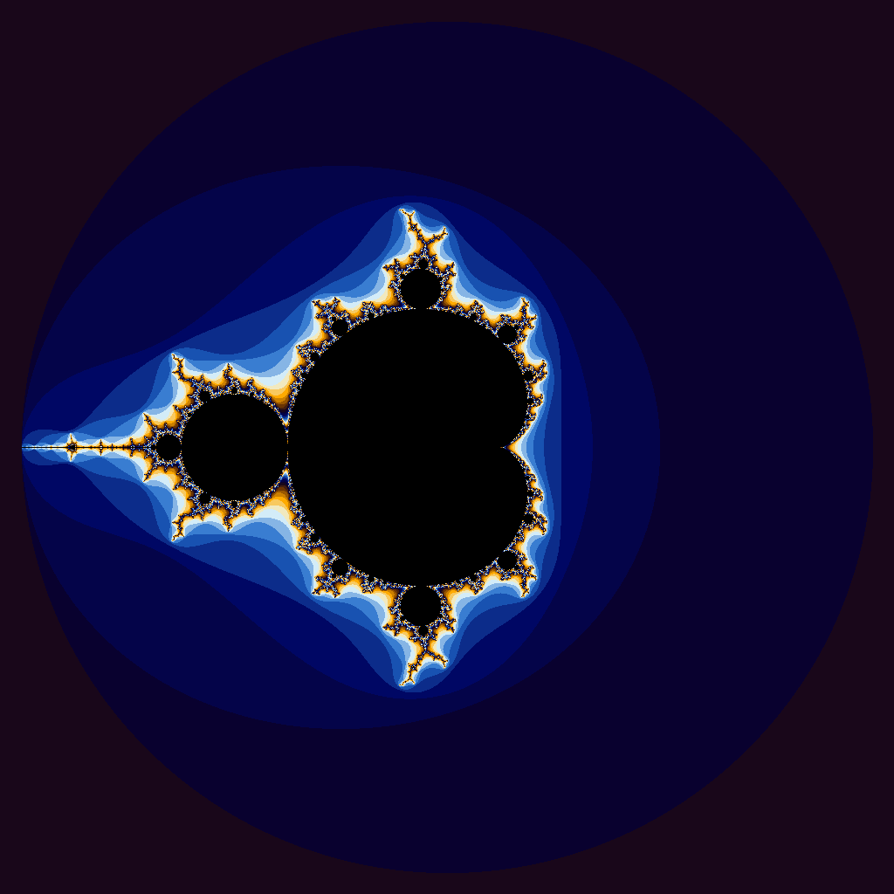

# Project 4

## iota
- iota.cpp is the CPU reference implementation that fills a vector with std::iota.
- iota.cu is the CUDA version. It launches one thread per element and writes startValue + index directly into the output array.

## Julia set
- julia.cpp is the CPU renderer for the fractal image.
- julia.cu ports the same per-pixel loop to CUDA. Each thread computes one pixel, iterating the complex recurrence until the point escapes or reaches the iteration limit.

## iota timing results
The following results were measured on the Oblivus RTX A6000 machine.

### CPU (iota.cpu)
|Vector Length|Wall Clock Time|User Time|System Time|
|:--:|--:|--:|--:|
|10| 0.00| 0.00| 0.00|
|100| 0.00| 0.00| 0.00|
|1000| 0.00| 0.00| 0.00|
|10000| 0.00| 0.00| 0.00|
|100000| 0.00| 0.00| 0.00|
|1000000| 0.00| 0.00| 0.00|
|5000000| 0.02| 0.00| 0.01|
|100000000| 0.58| 0.09| 0.48|
|500000000| 2.83| 0.45| 2.37|
|1000000000| 5.74| 0.96| 4.77|

### GPU (iota.gpu)
|Vector Length|Wall Clock Time|User Time|System Time|
|:--:|--:|--:|--:|
|10| 0.35| 0.01| 0.31|
|100| 0.24| 0.00| 0.22|
|1000| 0.28| 0.01| 0.25|
|10000| 0.25| 0.01| 0.23|
|100000| 0.25| 0.01| 0.22|
|1000000| 0.26| 0.01| 0.22|
|5000000| 0.31| 0.02| 0.26|
|100000000| 0.92| 0.19| 0.70|
|500000000| 3.72| 1.01| 2.69|
|1000000000| 6.83| 1.76| 5.05|

### Why CUDA is slower here
These results are what I expected for this workload. The operation per element is extremely small (just one add/store), so there is not much arithmetic to amortize overhead. CUDA pays fixed costs for kernel launch plus memory transfer between host and device. For this simple linear fill, the CPU benefits from very low overhead and efficient memory streaming, while the GPU spends more time in setup and transfer than it gains in parallel execution.

## Image
The generated image below uses the default start point z0 = (0, 0), so it is the Mandelbrot set rather than a different Julia set.

